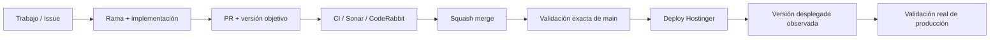

# Cóndor — Snapshot de desarrollo

> **Panel visual del estado de la entrega actual.**  
> El progreso acumulativo vive en el [roadmap canónico — Issue #1](https://github.com/pl0n3r/Condor/issues/1).

  <strong>Mercado:</strong> Colombia ·
  <strong>Idioma:</strong> es-CO ·
  <strong>Próxima versión:</strong> v0.1.0

## Convención de progreso

- ✅ ~~Completado y validado por los gates requeridos~~
- 🚧 Pendiente / en curso
- ⛔ Bloqueado / dependencia externa

## Estado del deploy

| Señal | Estado | Evidencia |
| --- | --- | --- |
| Versión objetivo | 🚧 **v0.1.0** | reservada para el primer deploy real |
| Versión desplegada | ⚪ **Sin deploy todavía** | no existe evidencia de una versión en producción |
| Base exacta | ✅ **main** | `242d7172e7db39a932c198e04f88badc260dda95` antes de esta PR |
| CI | 🚧 **Pendiente de bootstrap** | GitHub Actions todavía no está configurado |
| SonarCloud | 🚧 **Pendiente de bootstrap** | análisis aún no configurado |
| CodeRabbit | 🚧 **Activo en PRs** | revisión automática disponible |
| Producción | ⚪ **NO VALIDADA** | CI/merge no sustituyen despliegue ni validación real |

> Cuando Hostinger reciba por primera vez una release verificable, **Versión desplegada** cambiará a **v0.1.0**. A partir de ahí esta señal se actualizará en cada deploy.

## Fuentes de verdad

| Fuente | Propósito |
| --- | --- |
| [AGENTES.md](AGENTES.md) | cómo se trabaja |
| [ESPECIFICACIONES.md](ESPECIFICACIONES.md) | reglas, arquitectura y decisiones durables |
| [Roadmap #1](https://github.com/pl0n3r/Condor/issues/1) | trabajo planeado, realizado, pendiente y bloqueado |
| [ROADMAP.md](ROADMAP.md) | acceso directo al roadmap canónico |
| [GLOSARIO.md](GLOSARIO.md) | explicación sencilla de términos técnicos para seguimiento de negocio |

## Flujo de entrega

## Qué se hizo

- Se creó la base de gobierno de Cóndor.
- Se estableció español de Colombia como idioma principal del producto y del trabajo en GitHub.
- Se definió el roadmap canónico acumulativo en el Issue #1.
- Se creó `AGENTES.md` como protocolo operativo.
- Se separaron las especificaciones técnicas del seguimiento de progreso.
- Se definió el versionado por deploy empezando en **v0.1.0**.
- Se adopta para README la misma estrategia de snapshot por deploy utilizada en BRVTAL.

## Archivos modificados en este deploy

Este repositorio todavía no tiene un deploy real. Para la PR actual, los archivos de gobierno afectados son:

- `AGENTES.md` — reglas operativas, versionado y contrato del README.
- `ESPECIFICACIONES.md` — decisiones durables de versionado y snapshot por deploy.
- `README.md` — primer panel visual de desarrollo de Cóndor.
- `GLOSARIO.md` — guía de términos técnicos en lenguaje de negocio para socios.

## Validación

- La versión objetivo inicial queda en **v0.1.0**.
- No se declara `v0.1.0` como desplegada porque todavía no existe evidencia de Hostinger.
- CodeRabbit puede revisar la documentación de esta PR.
- CI y SonarCloud siguen pendientes de bootstrap.
- No se declara producción validada.

## Qué sigue

| Lane | Trabajo |
| --- | --- |
| **AHORA** | 🚧 Cerrar gobierno inicial del repositorio y snapshot README. |
| **SIGUE** | 🚧 Definir problema, usuarios, alcance MVP, roles y flujos principales. |
| **DESPUÉS** | 🚧 Arquitectura mínima viable + bootstrap técnico + CI/Sonar/Playwright. |
| **DEPLOY** | 🚧 Preparar Hostinger y realizar el primer deploy **v0.1.0**. |

## Panorama general pendiente

El detalle completo y acumulativo se mantiene en el [roadmap canónico #1](https://github.com/pl0n3r/Condor/issues/1).

| Frente | Estado |
| --- | --- |
| Gobierno y trazabilidad | 🚧 En curso |
| Definición del producto | 🚧 Pendiente / siguiente |
| Arquitectura | 🚧 Pendiente |
| CI + calidad automática | 🚧 Pendiente |
| Seguridad base | 🚧 Pendiente |
| Diseño y UX | 🚧 Pendiente |
| Primer vertical slice | 🚧 Pendiente |
| Hostinger + primer deploy v0.1.0 | 🚧 Pendiente |
