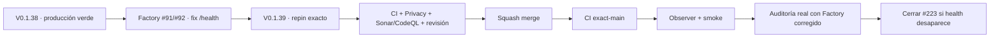

# Condor App — Snapshot operativo · candidato V 0.1.39

> **Objetivo actual:** resolver el falso positivo técnico `health` de la primera auditoría real repineando los callers de privacidad al Factory corregido, sin cambiar el mapa de datos ni declarar aprobación jurídica.

  <strong>Producción verificada:</strong> V 0.1.38 · main `6d9bb71c47fbd460a462ef5fa03d7132bd475dee` ·
  <strong>Candidato:</strong> V 0.1.39 · Issue #223

## Estado del deploy

| Señal | Estado | Evidencia |
| --- | --- | --- |
| Base productiva | ✅ **V 0.1.38 / GREEN** | `6d9bb71c47fbd460a462ef5fa03d7132bd475dee`; exact-main CI/CodeQL, observer y smoke aprobados |
| Contrato Factory | ✅ **FIX HEALTH INTEGRADO** | pin `68eef82e3b21939143a4cbea23b7df2615534e77`; Factory #91/#92 |
| Mapa de datos | ✅ **SIN CAMBIO EN ESTE CANDIDATO** | `datos.yml` no se modifica; la adopción inicial sigue bajo puerta jurídica #224 |
| Documentos | ✅ **SIN REGENERACIÓN** | los seis documentos no cambian porque el fix de Factory solo ajusta detección de señales |
| Primera auditoría real | ⚠️ **REVIEW_REQUIRED** | run `36054140014`; creó #223 por falso positivo `health` y #224 por adopción inicial material |
| Finding técnico #223 | 🚧 **CORRECCIÓN EN CURSO** | repin al Factory corregido y reejecución real pendiente |
| Puerta jurídica #224 | ⛔ **SEPARADA / VIGENTE** | requiere decisión humana; este candidato no la resuelve |

## Qué añade V 0.1.39

- repinea `.github/workflows/privacidad.yml` al Factory `68eef82e3b21939143a4cbea23b7df2615534e77`;
- repinea la auditoría semanal al mismo SHA inmutable;
- actualiza el contrato PHP para exigir ese pin exacto;
- mantiene los seis documentos canónicos y sus hashes actuales sin regenerarlos;
- corrige la trazabilidad del primer reporte real: fue `review_required`, no `clean`;
- no modifica esquema, lógica de negocio, `datos.yml`, tratamientos ni documentos jurídicos.

## Archivos del candidato

- `.github/workflows/privacidad.yml`
- `.github/workflows/auditoria-privacidad.yml`
- `tests/php/Privacy/PrivacyAsCodeTest.php`
- `config/version.php`
- `README.md`

## Invariantes

- `/health` por sí solo no representa un dato personal de salud;
- campos explícitos `health` siguen siendo sensibles en el Factory corregido;
- los documentos técnicos no constituyen aprobación jurídica;
- #224 permanece abierta hasta decisión humana;
- merge o CI verde no equivalen a producción verde;
- la resolución de #223 exige reejecutar la auditoría real con el nuevo Factory y comprobar que el finding técnico desaparece.

## Flujo de entrega

## Qué sigue

1. validar el candidato V0.1.39 sobre el HEAD final;
2. integrar por squash y validar el SHA exacto de `main`;
3. observar producción por separado;
4. reejecutar `Auditoría de privacidad`;
5. cerrar #223 únicamente si `health` deja de aparecer y conservar #224 separada.

## Referencias

- [AGENTES.md](./AGENTES.md)
- [ESPECIFICACIONES.md](./ESPECIFICACIONES.md)
- Roadmap canónico: Issue #1
- Finding técnico: Issue #223
- Puerta jurídica: Issue #224
- Factory privacidad: pl0n3r/factory#54
