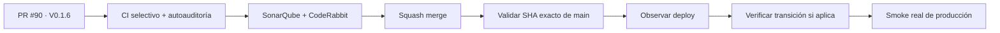

# Condor App — Snapshot de deploy V 0.1.6

> **Objetivo actual:** convertir el CI de Condor en un sistema autoauditable, selectivo y autocurable solo ante fallos externos realmente transitorios.

  <strong>Producto:</strong> Condor App ·
  <strong>Dominio:</strong> condorapp.com.co ·
  <strong>Runtime producción:</strong> PHP 8.5 ·
  <strong>Versión objetivo:</strong> V 0.1.6 ·
  <strong>Versión desplegada comprobada:</strong> V 0.1.4

## Estado del deploy

| Señal | Estado | Evidencia |
| --- | --- | --- |
| Base de código | ✅ **V 0.1.5 EN MAIN** | SHA `cda816fdd34f63eaa941e1aca524fe25af48b7f2` |
| Producción comprobada | ✅ **V 0.1.4 VALIDADA EN PRODUCCIÓN** | último smoke real documentado |
| V 0.1.5 | ⏳ **MERGED, NO INFERIR PRODUCCIÓN** | observabilidad segura integrada; deploy/migración se validan aparte |
| V 0.1.6 | 🚧 **EN VALIDACIÓN DE CÓDIGO** | Issue #89 / PR #90 |
| CI selectivo | ✅ **IMPLEMENTADO** | clasificación de cambios y gates fail-safe |
| Autoauditoría | ✅ **IMPLEMENTADA** | timeouts, permisos, checkout y wrappers revisados por contrato |
| Autocuración | ✅ **ACOTADA** | retries solo para señales externas/transitorias autorizadas |
| Producción V 0.1.6 | ⏳ **NO VALIDADA** | requiere merge, exact-main, deploy observado y smoke real |

## Qué se hizo

- Clasificación de cambios para evitar gates pesados cuando no aportan cobertura.
- Auditoría automática del propio CI para prevenir drift de seguridad y configuración.
- Reintentos con backoff únicamente ante fallos externos/transitorios verificables.
- Timeouts explícitos y permisos mínimos en workflows críticos.
- Telemetría de throughput para identificar el gate dominante sin bloquear entregas.
- Observador de releases con verificación explícita de transiciones operativas antes de declarar producción válida.
- Regresiones para rutas especiales como `bin/console`, wrappers por comando y fallos deterministas.

## Archivos de esta entrega

- `.github/workflows/ci.yml`
- `.github/workflows/ci-throughput-telemetry.yml`
- `.github/workflows/observar-release.yml`
- `.github/workflows/coordinacion-trabajo.yml`
- `.github/workflows/sincronizar-gobierno.yml`
- `.github/workflows/sonar-annotation-relay.yml`
- `scripts/ci_change_classifier.py`
- `scripts/ci_retry.py`
- `scripts/ci_self_audit.py`
- `scripts/ci_throughput_report.py`
- `scripts/observar_release.py`
- pruebas de contrato asociadas
- `config/version.php`, `package.json`, `package-lock.json`

## Validación

- Findings conocidos de CodeRabbit del PR #90: corregidos antes de esta sincronización.
- Rama reconciliada sobre el `main` exacto V 0.1.5, preservando la autocuración más reciente del observador.
- CI, SonarQube y CodeRabbit: deben revalidarse sobre el nuevo head exacto.
- Ningún estado de CI equivale a `VALIDADO EN PRODUCCIÓN`.

## Flujo de entrega

## Qué sigue

| Horizonte | Bloque |
| --- | --- |
| **AHORA** | cerrar gates finales de PR #90 / V 0.1.6 |
| **SIGUE** | sincronizar y cerrar PR #103 — roles y permisos configurables por sede / V 0.1.7 |
| **DESPUÉS** | continuar el siguiente slice funcional según Roadmap #1 |

## Fuentes de verdad

- [AGENTES.md](AGENTES.md) — protocolo operativo.
- [ESPECIFICACIONES.md](ESPECIFICACIONES.md) — decisiones durables.
- [Roadmap #1](https://github.com/pl0n3r/Condor/issues/1) — único Roadmap canónico.
- [Issue #89](https://github.com/pl0n3r/Condor/issues/89) / [PR #90](https://github.com/pl0n3r/Condor/pull/90) — entrega V 0.1.6.
