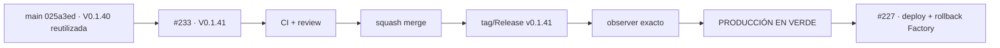

# Condor App — Snapshot operativo · recuperación V 0.1.41

> **Objetivo actual:** corregir la identidad release↔SHA después de que #230 desplegara un SHA nuevo conservando V 0.1.40, ya publicada para otro commit. Este hotfix no cambia Sentry ni datos; solo asigna una versión nueva al estado ya desplegado.

  <strong>Última producción formalmente GREEN:</strong> V 0.1.40 · `8c52dc4fefab9ac16722ec11ea09d52359008030` ·
  <strong>Estado observado sin release único:</strong> `025a3ed10d87a83ab9686202abac1a55978855dc` ·
  <strong>Candidato de recuperación:</strong> V 0.1.41 · Issue #233

## Estado del deploy

| Señal | Estado | Evidencia |
| --- | --- | --- |
| Producción base GREEN | ✅ **V 0.1.40** | cierre GREEN en Roadmap #1 sobre `8c52dc4...` |
| SHA actual observado | ⚠️ **025a3ed… bajo V 0.1.40 reutilizada** | observer productivo exacto; release no pudo publicarse |
| Causa raíz | ⚠️ **versión canónica no incrementada en #230** | `config/version.php` permaneció 0.1.40 |
| Release 0.1.40 | ✅ **ya existe** | tag/GitHub Release pertenecen al SHA anterior |
| Hotfix | 🚧 **V 0.1.41** | cambia versión + este snapshot; sin cambio de runtime |
| Sentry | ✅ **sin activación nueva** | `SENTRY_DSN` permanece vacío; #224 sigue siendo la puerta legal |
| Esquema/datos | ✅ **sin cambios** | no hay migraciones ni mutaciones |

## Qué hace V 0.1.41

- asigna una identidad humana nueva al código ya desplegado tras #230;
- permite que Factory Release cree `v0.1.41` sin colisionar con `v0.1.40`;
- conserva intacta la integración Sentry minimizada y apagada por defecto;
- no cambia esquema, configuración productiva, DNS, cron ni hosting;
- obliga a validar por separado tag/Release, observer y cinco puntos de PRODUCCIÓN EN VERDE.

## Archivos del candidato

- `config/version.php` — 0.1.40 → 0.1.41.
- `README.md` — snapshot exacto del incidente #233.

## Invariantes

- Merge/CI verde no equivalen a producción validada.
- No se mueve ni reemplaza el tag `v0.1.40`.
- No se activa Sentry sin la puerta legal correspondiente.
- No se ejecuta #227 hasta recuperar GREEN sobre V 0.1.41.
- El deploy/rollback Factory sigue separado en #227.

## Flujo de recuperación

## Qué sigue

1. integrar #233 solo con gates verdes;
2. demostrar `v0.1.41` sobre el SHA exacto de main;
3. revalidar producción GREEN;
4. desplazar #227/#228 a V 0.1.42 / V 0.1.43;
5. retomar TANDA 2 de #192.

## Referencias

- [AGENTES.md](./AGENTES.md)
- [ESPECIFICACIONES.md](./ESPECIFICACIONES.md)
- Roadmap canónico: Issue #1
- Incidente actual: Issue #233
- Épico Factory: Issue #192
- Factory: `pl0n3r/factory@v1`
