# Cóndor — Snapshot de desarrollo

> **Panel visual del estado actual del proyecto.**  
> El progreso acumulativo vive en el [roadmap canónico — Issue #1](https://github.com/pl0n3r/Condor/issues/1).

  <strong>Mercado:</strong> Colombia ·
  <strong>Idioma:</strong> es-CO ·
  <strong>Versión objetivo:</strong> V 0.1.0

## Estado del deploy

| Señal | Estado | Evidencia |
| --- | --- | --- |
| Versión objetivo | 🚧 **V 0.1.0** | primera entrega en preparación |
| Versión desplegada | ⚪ **Sin deploy todavía** | no existe evidencia de una versión en producción |
| Base exacta previa | ✅ **main** | `9acb394c948b22f1e852ff6e4d226875abcc55e2` |
| CI | 🚧 **En bootstrap** | PR de infraestructura prepara preflight + gates paralelos + check agregado `Validar` |
| SonarCloud | 🚧 **Pendiente** | requiere configuración específica posterior |
| CodeRabbit | 🚧 **Configurándose** | reglas genéricas inspiradas en BRVTAL y comentarios solicitados en español |
| Producción | ⚪ **NO VALIDADA** | CI/merge no sustituyen despliegue ni validación real |

## Fuentes de verdad

| Fuente | Propósito |
| --- | --- |
| [AGENTES.md](AGENTES.md) | cómo se trabaja |
| [ESPECIFICACIONES.md](ESPECIFICACIONES.md) | reglas, arquitectura y decisiones durables |
| [Roadmap #1](https://github.com/pl0n3r/Condor/issues/1) | trabajo planeado, realizado, pendiente y bloqueado |
| [GLOSARIO.md](GLOSARIO.md) | explicación sencilla de términos técnicos para seguimiento de negocio |

## Flujo de entrega

```mermaid
flowchart LR
 A["Trabajo / Issue"] --> B["Rama + implementación"]
 B --> C["PR (V X.Y.Z)"]
 C --> D["Preflight"]
 D --> E["Gates paralelos"]
 E --> F["Validar"]
 F --> G["Sonar / CodeRabbit"]
 G --> H["Squash merge"]
 H --> I["Validación exacta de main"]
 I --> J["Deploy Hostinger"]
 J --> K["Versión desplegada observada"]
 K --> L["Validación real de producción"]
```

## Qué se hizo

- Gobierno documental y roadmap establecidos.
- `AGENTES.md`, `ESPECIFICACIONES.md` y `GLOSARIO.md` separados por responsabilidad.
- Versionado de tracking obligatorio en títulos de GitHub.
- Roadmap convertido en log exclusivo de trabajo/progreso.
- Issue #8 abierto para bootstrap de gobierno técnico y CI.
- CI canónico inicial preparado con preflight, validaciones paralelas y check agregado.
- Plantillas de Issues/PR en español preparadas.
- Sincronización automática de labels en español y milestone de **V 0.1.0** preparada.
- CodeRabbit configurado con instrucciones generales de revisión en español.

## Archivos de la entrega actual

- `.coderabbit.yaml`
- `.github/ISSUE_TEMPLATE/config.yml`
- `.github/ISSUE_TEMPLATE/error.yml`
- `.github/ISSUE_TEMPLATE/mejora.yml`
- `.github/ISSUE_TEMPLATE/tarea.yml`
- `.github/pull_request_template.md`
- `.github/labels.json`
- `.github/workflows/ci.yml`
- `.github/workflows/sincronizar-gobierno.yml`
- `scripts/validar_documentacion.py`
- `README.md`

## Validación

- El CI de esta PR debe validarse a sí mismo antes del merge.
- El título del PR es rechazado automáticamente si no termina con `(V X.Y.Z)`.
- Los enlaces relativos y archivos documentales canónicos tienen validación automática.
- El workflow de gobierno sincronizará labels/milestone al entrar a `main`.
- SonarCloud permanece pendiente y no se presenta como configurado.
- No existe evidencia de deploy ni validación de producción.

## Qué sigue

| Lane | Trabajo |
| --- | --- |
| **AHORA** | 🚧 Validar y cerrar gobierno GitHub + CI inicial (V 0.1.0), Issue #8. |
| **SIGUE** | 🚧 Protección de `main` con el check agregado `Validar`. |
| **DESPUÉS** | 🚧 Definición funcional del producto + bootstrap técnico de aplicación. |
| **CALIDAD** | 🚧 SonarCloud + baseline de pruebas + Playwright. |
| **DEPLOY** | 🚧 Preparar Hostinger y realizar el primer deploy real **V 0.1.0**. |

## Panorama general pendiente

| Frente | Estado |
| --- | --- |
| Gobierno y trazabilidad | 🟡 En cierre |
| CI base | 🟡 En bootstrap |
| Definición del producto | ⚪ Pendiente |
| Arquitectura | ⚪ Pendiente |
| SonarCloud + pruebas | ⚪ Pendiente |
| Seguridad base | ⚪ Pendiente |
| Diseño y UX | ⚪ Pendiente |
| Primer vertical slice | ⚪ Pendiente |
| Hostinger + primer deploy V 0.1.0 | ⚪ Pendiente |
