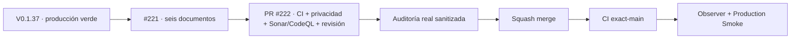

# Condor App — Snapshot operativo · candidato V 0.1.38

> **Objetivo actual:** revalidar privacidad como código contra el contrato vigente de seis documentos de Factory, conservando el mapa técnico existente y sin declarar aprobación jurídica.

  <strong>Producción verificada:</strong> V 0.1.37 · main `a25b88f49ce2a2fc5492dd16d22afc8c0bc79b8c` ·
  <strong>Candidato:</strong> V 0.1.38 · Issue #221 · PR #222

## Estado del deploy

| Señal | Estado | Evidencia |
| --- | --- | --- |
| Base productiva | ✅ **V 0.1.37 / GREEN** | `a25b88f49ce2a2fc5492dd16d22afc8c0bc79b8c`; exact-main, observer y smoke aprobados |
| Contrato Factory | ✅ **6 DOCUMENTOS** | pin `4b2be9fcf827278631caa3e3e68603b6e2a680d7` |
| Mapa de datos | ✅ **SIN CAMBIO MATERIAL** | `datos.yml` continúa como fuente de verdad; placeholders y `review_required` se preservan |
| Documentos | ✅ **GENERADOS** | política, aviso, términos, registro, canal de derechos y retención |
| Caller de auditoría | ⛔ **SIN EJECUCIÓN REAL AÚN** | el workflow existe y queda pinneado al contrato vigente; no se inventa evidencia |
| Candidato V0.1.38 | 🚧 **EN REVISIÓN** | PR #222; CI/Sonar/CodeQL/revisión y auditoría real pendientes antes de integrar |

## Qué añade V 0.1.38

- actualiza los callers de privacidad y auditoría al Factory vigente;
- amplía el set versionado de tres a **seis documentos canónicos**;
- congela los seis documentos con regresiones SHA-256 byte-a-byte;
- falla si falta o deriva cualquiera de los documentos esperados;
- mantiene responsable, bases, consentimientos y retenciones no demostradas en estado pendiente de revisión;
- no modifica esquema, lógica de negocio ni datos productivos.

## Archivos del candidato

- `.github/workflows/privacidad.yml`
- `.github/workflows/auditoria-privacidad.yml`
- `config/version.php`
- `docs/privacidad/aviso-privacidad.md`
- `docs/privacidad/canal-derechos.md`
- `docs/privacidad/terminos-condiciones.md`
- `tests/php/Privacy/PrivacyAsCodeTest.php`

Los tres documentos históricos —política, registro y retención— ya coincidían byte a byte con el nuevo generador y por eso no generan diff.

## Invariantes

- los documentos técnicos no constituyen aprobación jurídica;
- no se introducen PII real, secretos ni datos del responsable;
- `datos.yml` sigue siendo la fuente única de verdad del producto;
- una auditoría real se registra solo cuando exista una ejecución verificable de GitHub Actions;
- merge o CI verde no equivalen a producción verde;
- producción solo se declara verde con versión/SHA exactos, observer, smoke y gates exact-main aprobados.

## Flujo de entrega

## Qué sigue

1. cerrar gates del HEAD estable de PR #222;
2. obtener una ejecución real y sanitizada del caller de auditoría;
3. integrar serialmente V0.1.38;
4. validar exact-main, observer y smoke antes de actualizar el Roadmap #1 y Factory#54.

## Referencias

- [AGENTES.md](./AGENTES.md)
- [ESPECIFICACIONES.md](./ESPECIFICACIONES.md)
- Roadmap canónico: Issue #1
- Revalidación vigente: Issue #221
- Adopción histórica: Issue #217
- Factory privacidad: pl0n3r/factory#54
