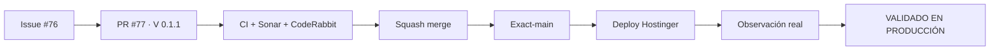

# Condor App — Snapshot de deploy V 0.1.1

> **Objetivo de esta entrega:** recuperar el render del home corporativo en Hostinger y dejar el bootstrap preparado para shared hosting sin secretos versionados.

  <strong>Producto:</strong> Condor App ·
  <strong>Mercado:</strong> Colombia ·
  <strong>Dominio:</strong> www.condorapp.com.co ·
  <strong>Versión objetivo:</strong> V 0.1.1

## Estado del deploy

| Señal | Estado | Evidencia |
| --- | --- | --- |
| Versión objetivo | 🚧 **V 0.1.1** | Issue #76 / PR #77 |
| Versión desplegada | ⚠️ **V 0.1.0 observada** | routing hacia Symfony llegó a Hostinger, pero el home se reporta en blanco |
| Main actual antes del merge | ✅ | `779a92e04da491cb076bbb9461f05a63ab8c5469` |
| CI del PR | ✅ **Verde** | head `e47405cd4a51f129ee698d179124476784aace6d`, run `35492258455` |
| SonarQube Cloud | ✅ **Verde** | 0 issues nuevos · 0 hotspots |
| CodeRabbit | 🚧 **Pendiente** | revisión solicitada sobre el head estable |
| Producción | ⛔ **NO VALIDADA** | el usuario sigue observando home blanco |

## Qué se hizo

- Se endureció el bootstrap para Hostinger cuando no existe un `.env` versionado.
- `APP_SECRET` puede generarse y persistirse en runtime fuera de Git.
- La ausencia de `DATABASE_URL` deja arrancar las superficies públicas sin fingir una conexión real.
- La versión de producto sube de **0.1.0 → 0.1.1**.
- CI y Playwright dejaron de depender de una versión fija y ahora leen `config/version.php`.
- Se corrigió el finding de Sonar sobre credenciales ficticias hardcodeadas.
- Se mantiene paridad entre `config/version.php`, `package.json` y `package-lock.json`.

## Archivos de la entrega actual

- `config/bootstrap.php`
- `config/version.php`
- `src/Shared/Runtime/RuntimeEnvironment.php`
- `tests/php/Shared/Runtime/RuntimeEnvironmentTest.php`
- `.github/workflows/ci.yml`
- `tests/e2e/slice1.spec.mjs`
- `package.json`
- `package-lock.json`
- `README.md`

## Validación

- PHP, Composer, configuración Symfony y migraciones en MariaDB descartable: ✅
- PHPUnit / regresiones runtime: ✅
- Smoke HTTP + login real: ✅
- Playwright Chromium desktop/mobile: ✅
- SonarQube Cloud: ✅ 0 issues / 0 hotspots
- CodeRabbit: 🚧 pendiente
- Producción V 0.1.1: 🚧 pendiente de merge, deploy y observación real

## Qué sigue

| Lane | Trabajo |
| --- | --- |
| **AHORA** | Cerrar CodeRabbit y hacer squash merge de PR #77 |
| **SIGUE** | Validar el SHA exacto resultante de `main` |
| **DESPUÉS** | Observar Hostinger: `/health`, home, footer, CSS y login |
| **P0** | No cerrar Issue #76 hasta que el home deje de aparecer blanco |

## Flujo de entrega

## Fuentes de verdad

- [AGENTES.md](AGENTES.md) — protocolo operativo.
- [ESPECIFICACIONES.md](ESPECIFICACIONES.md) — decisiones durables.
- [Roadmap #1](https://github.com/pl0n3r/Condor/issues/1) — plan acumulativo y bitácora cronológica.
- [GLOSARIO.md](GLOSARIO.md) — términos técnicos en lenguaje de negocio.
