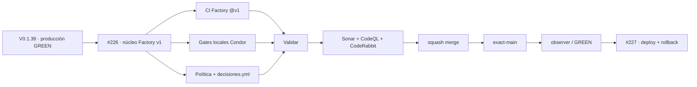

# Condor App — Snapshot operativo · candidato V 0.1.40

> **Objetivo actual:** primer slice de TANDA 2. Adoptar el núcleo Factory v1 y las decisiones del dueño como código sin reducir la cobertura específica de Condor ni tocar lógica de negocio, esquema o datos.

  <strong>Producción verificada:</strong> V 0.1.39 · main `9b652077be9f18b920d15cb02bf3941b9358baf9` ·
  <strong>Candidato:</strong> V 0.1.40 · Issue #226 · PR #229

## Estado del deploy

| Señal | Estado | Evidencia |
| --- | --- | --- |
| Base productiva | ✅ **V 0.1.39 / GREEN** | `9b652077be9f18b920d15cb02bf3941b9358baf9`; cierre GREEN en Roadmap #1 |
| Observer base | ✅ **success** | run `36063691947`; versión/SHA exactos observados |
| CI exact-main base | ✅ **success** | run `36063691913` |
| Push on main base | ✅ **success** | run `36063690840` |
| Release base | ✅ **success** | run `36063691909` |
| Factory común | 🚧 **CANDIDATO** | CI PHP base, coordinador, etiquetas, política y release consumidos desde `factory@v1` |
| Decisiones como código | 🚧 **CANDIDATO** | `decisiones.yml` con D-054…D-059 y límite de 3 rondas |
| Gates específicos Condor | ✅ **PRESERVADOS EN DISEÑO** | MariaDB, contratos, frontend, auditorías, backup/restore y Playwright siguen en CI local |
| Producción objetivo | ⏳ **NO TOCADA EN ESTE SLICE** | deploy/rollback Factory queda en #227 |

## Qué añade V 0.1.40

- crea `decisiones.yml` como contrato normativo verificable por Factory;
- reduce `AGENTES.md` a la capa propia de Condor y referencia el núcleo Factory v1;
- añade CI Factory reusable en paralelo como gate PHP base y lo vuelve requisito del agregado `Validar`; Node/TypeScript, Symfony/MariaDB, contratos y Playwright permanecen en los gates locales para evitar que el `npm ci` reusable contamine la validación documental con `node_modules`;
- consume el coordinador canónico desde `factory@v1` mediante un adaptador por evento con permisos mínimos; etiquetas, política y release usan los reusable workflows Factory;
- sustituye la ejecución de la coordinación local en CI por la validación reusable Factory y elimina la implementación/test locales ya supersedidos;
- adapta la autoauditoría para permitir exclusivamente el canal mayor aprobado `factory@v1`, manteniendo SHA fijo para otros workflows externos;
- mantiene intactos los gates específicos de Condor y no modifica datos, esquema ni runtime de producto.

## Archivos del candidato

- `.github/workflows/ci.yml`
- `.github/workflows/coordinacion-trabajo.yml`
- `.github/workflows/politica.yml`
- `.github/workflows/sincronizar-gobierno.yml`
- `.github/workflows/tag-release.yml`
- `AGENTES.md`
- `config/version.php`
- `decisiones.yml`
- `scripts/ci_self_audit.py`
- `scripts/coordinar_trabajo.py` — eliminado; sustituido por Factory v1
- `tests/contract/test_tooling_contract.py`
- `tests/test_ci_factory_adoption.py`
- `tests/test_ci_self_audit.py`
- `tests/test_coordinar_trabajo.py` — eliminado junto con la copia local del coordinador
- `README.md`

## Invariantes

- Factory v1 reemplaza únicamente lógica común; la cobertura específica de Condor no se elimina. Node queda deshabilitado en el CI Factory porque su `npm ci` hace que `npm test` vea documentación de `node_modules`; la cobertura Node real permanece en los gates locales.
- Los reusable workflows Factory se consumen por el canal compatible `@v1`; otros workflows externos siguen requiriendo SHA de 40 caracteres.
- No se heredan secretos a Factory.
- `Validar` no puede quedar verde si falla el CI Factory.
- La coordinación activa usa `.factory/scripts/coordinar_trabajo.py` desde `factory@v1`; la copia local y su suite fueron retiradas. El PR bootstrap #226 valida la reserva legacy sin fingerprint y los PR siguientes vuelven a exigir fingerprint automáticamente al detectar `decisiones.yml` en la base.
- Merge/CI verde no equivalen a producción validada.
- #227 concentra deploy/rollback Hostinger y #228 la prueba end-to-end/cierre del épico #192.

## Flujo de entrega

## Qué sigue

1. estabilizar PR #229 sobre un HEAD final;
2. squash merge solo con CI/revisión completos;
3. validar exact-main y producción por separado;
4. cerrar/superseder #206/#207 y deuda absorbida por el kit solo con evidencia post-merge;
5. continuar #227 y después #228.

## Referencias

- [AGENTES.md](./AGENTES.md)
- [ESPECIFICACIONES.md](./ESPECIFICACIONES.md)
- Roadmap canónico: Issue #1
- Épico Factory: Issue #192
- Slice actual: Issue #226 / PR #229
- Factory: `pl0n3r/factory@v1`
