# Condor App — Snapshot de desarrollo

> **Panel visual del estado actual del proyecto.**  
> El progreso acumulativo vive en el [roadmap canónico — Issue #1](https://github.com/pl0n3r/Condor/issues/1).

  <strong>Mercado:</strong> Colombia ·
  <strong>Idioma:</strong> es-CO ·
  <strong>Dominio:</strong> www.condorapp.com.co ·
  <strong>Versión objetivo:</strong> V 0.1.0

## Estado del deploy

| Señal | Estado | Evidencia |
| --- | --- | --- |
| Versión objetivo | 🚧 **V 0.1.0** | primera entrega en preparación |
| Versión desplegada | ⚪ **Sin deploy todavía** | no existe evidencia de una versión en producción |
| Base exacta previa | ✅ **main** | `ae2cf36eba6b6e8178bd8a921303fb46f7d961c2` |
| CI | ✅ **Activo** | `main` `ae2cf36`: CI exact-main verde; gates paralelos + coordinación + `Validar` |
| Telemetría CI | ✅ **Activa** | run `35469048187`: CI con Playwright medido en 50 s; Chromium fue el gate dominante con 37 s |
| SonarQube Cloud | ✅ **Activo** | Quality Gate + relay detallado de hallazgos hacia comentarios de PR |
| Relay Sonar | ✅ **Activo** | `main` `756ca31`: publica/actualiza un comentario único con archivo, línea, severidad y detalle de cada anotación |
| CodeRabbit | ✅ **Configurado** | `.coderabbit.yaml` activo con perfil assertive e instrucciones de revisión en español |
| Coordinación multiagente | ✅ **Activa** | Issue #18 validó toma única, rechazo de colisión y liberación; PR #20 cerró la carrera de limpieza |
| Baseline de pruebas | ✅ **Activo** | Issue #23 / PR #24: contrato + integración + Playwright Chromium; exact-main verde |
| Optimización Playwright | 🚧 **Validando merge** | PR #26: gate 37 s → 12 s; CI de PR 50 s → 31 s; cobertura preservada |
| Producción | ⚪ **NO VALIDADA** | CI/merge no sustituyen despliegue ni validación real |

## Fuentes de verdad

| Fuente | Propósito |
| --- | --- |
| [AGENTES.md](AGENTES.md) | cómo se trabaja |
| [ESPECIFICACIONES.md](ESPECIFICACIONES.md) | reglas, arquitectura y decisiones durables |
| [Roadmap #1](https://github.com/pl0n3r/Condor/issues/1) | trabajo planeado, realizado, pendiente y bloqueado |
| [GLOSARIO.md](GLOSARIO.md) | explicación sencilla de términos técnicos para seguimiento de negocio |

## Flujo de entrega

```mermaid
flowchart LR
 A["Issue disponible"] --> B["/tomar"]
 B --> C["Lock + UUID de reserva"]
 C --> D["trabajo/issue-N"]
 D --> E["PR + Closes #N + Reserva UUID"]
 E --> F["CI + coordinación"]
 F --> G["Sonar / CodeRabbit"]
 G --> H["Squash merge serial"]
 H --> I["Validación exacta de main"]
 I --> J["Deploy Hostinger"]
 J --> K["Versión desplegada observada"]
 K --> L["Validación real de producción"]
```

## Qué se hizo

- Gobierno documental y roadmap establecidos.
- `AGENTES.md`, `ESPECIFICACIONES.md` y `GLOSARIO.md` separados por responsabilidad.
- Versionado de tracking obligatorio en títulos de GitHub.
- Roadmap convertido en log exclusivo de trabajo/progreso.
- Issue #8 cerrado: gobierno técnico y CI base validados en código.
- CI canónico activo con preflight, validaciones paralelas y check agregado `Validar`.
- Plantillas de Issues/PR en español activas.
- Labels en español sincronizados y milestone **Primera entrega (V 0.1.0)** creado.
- CodeRabbit configurado con perfil assertive e instrucciones generales de revisión en español.
- Coordinación multiagente validada en GitHub real: reserva atómica, UUID por sesión, rechazo de segunda toma, liberación y limpieza idempotente.
- Telemetría de throughput del CI activa; primera medición real: 19 s y artifact con evidencia.
- Baseline técnico de contrato, integración y Playwright activo sin inventar lógica funcional.
- `main` protegido por ruleset: PR obligatorio, check `Validar` requerido y sin bypass.
- Playwright optimizado con Chrome estable del runner: 37 s → 12 s en PR #26; la caché de 271 MB fue descartada por ahorrar solo ~2 s.

## Archivos de la entrega actual

- `.github/workflows/ci.yml`
- `playwright.config.mjs`
- `ESPECIFICACIONES.md`
- `README.md`

## Validación

- PRs #9/#11 validaron el CI inicial; el SHA exacto `4051563` terminó con CI y gobierno en verde.
- El título del PR es rechazado automáticamente si no termina con `(V X.Y.Z)`.
- Los enlaces relativos y archivos documentales canónicos tienen validación automática.
- El workflow de gobierno sincronizó labels y creó el milestone #1 `Primera entrega (V 0.1.0)`.
- SonarQube Cloud está activo; el Quality Gate se revisa en cada PR cuando la integración reporta resultados.
- PR #26 redujo el gate Playwright de 37 s a 12 s en la medición de PR, manteniendo el mismo harness y evidencia de fallo.
- El experimento de caché de browsers fue descartado: cache hit real 35 s → 33 s restaurando ~271 MB.
- No existe evidencia de deploy ni validación de producción.

## Qué sigue

| Lane | Trabajo |
| --- | --- |
| **AHORA** | 🚧 Cerrar optimización de Playwright con validación exacta de `main`, Issue #25 / PR #26. |
| **SIGUE** | 🚧 Definición funcional del producto. |
| **DESPUÉS** | 🚧 Definición funcional del producto + bootstrap técnico de aplicación. |
| **CALIDAD** | 🟢 Playwright 37 s → 12 s en PR #26; SonarQube Cloud y baseline de pruebas activos. |
| **DEPLOY** | 🚧 Preparar Hostinger y realizar el primer deploy real **V 0.1.0**. |

## Panorama general pendiente

| Frente | Estado |
| --- | --- |
| Gobierno y trazabilidad | 🟢 Base activa; `main` protegida con `Validar` obligatorio y sin bypass |
| CI base | 🟢 Activo |
| Telemetría de CI | 🟢 Activa; último exact-main con Playwright: 50 s, Chromium 37 s |
| Definición del producto | ⚪ Pendiente |
| Arquitectura | ⚪ Pendiente |
| SonarQube Cloud | 🟢 Activo; ampliar integración con CI |
| Pruebas | 🟢 Baseline técnico activo; optimización de Chromium en Issue #25 |
| Seguridad base | ⚪ Pendiente |
| Diseño y UX | ⚪ Pendiente |
| Primer vertical slice | ⚪ Pendiente |
| Hostinger + primer deploy V 0.1.0 | ⚪ Pendiente |
