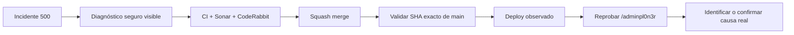

# Condor App — Snapshot operativo · hotfix V 0.1.10

> **Objetivo actual:** convertir los errores 5xx del Super Admin en diagnósticos seguros y accionables sin activar debug ni exponer secretos.

  <strong>Producto:</strong> Condor App ·
  <strong>Dominio:</strong> condorapp.com.co ·
  <strong>Runtime producción:</strong> PHP 8.5 ·
  <strong>Versión objetivo:</strong> V 0.1.10 ·
  <strong>Última versión validada en producción:</strong> V 0.1.4

## Estado del deploy

| Señal | Estado | Evidencia |
| --- | --- | --- |
| Base de código | ✅ **V 0.1.9 EN MAIN** | SHA `fb21af72cdabf94539e654f110793ea3f146e3b5` |
| Super Admin V 0.1.9 | ✅ **MERGED** | PR #118 |
| Incidente reportado | 🔴 **500 EN /adminpl0n3r TRAS LOGIN** | reportado después de #118; causa exacta aún por observar |
| Producción comprobada | ✅ **V 0.1.4 VALIDADA EN PRODUCCIÓN** | último smoke real documentado |
| V 0.1.10 | 🚧 **HOTFIX EN VALIDACIÓN DE CÓDIGO** | Issue #133 |
| Producción V 0.1.10 | ⏳ **NO VALIDADA** | requiere merge, deploy observado y smoke real |

## Qué cambia en V 0.1.10

- Los 5xx siguen generando una referencia segura para cualquier usuario.
- Si la sesión pertenece a `ROLE_PLATFORM_OWNER`, la página 500 muestra además:
  - status HTTP;
  - ruta Symfony;
  - clase de excepción;
  - mensaje sanitizado;
  - request ID;
  - versión;
  - release SHA.
- El detalle privilegiado **no incluye** stack trace, headers, cookies, body, variables de entorno, SQL ni secretos.
- Las respuestas JSON 5xx del Super Admin incluyen el mismo diagnóstico sanitizado solo para el propietario.
- React muestra ese diagnóstico dentro del centro de control cuando falla `/adminpl0n3r/api/context`.
- `/adminpl0n3r/diagnosticos` muestra mensaje sanitizado, request ID y release para incidentes recientes.
- La página 500 privilegiada no depende de Twig, para seguir funcionando aunque el fallo involucre render/cache.

## Archivos principales

- `src/Infrastructure/Observability/ErrorIncidentPresenter.php`
- `src/Infrastructure/Observability/ErrorIncidentSubscriber.php`
- `frontend/admin/PlatformOwnerApp.tsx`
- `frontend/admin/admin.css`
- `templates/platform_owner/diagnostics.html.twig`
- `tests/php/Infrastructure/Observability/ErrorIncidentPresenterTest.php`
- metadata de versión V 0.1.10

## Validación

- CI, backend/MariaDB, contratos y Playwright deben quedar verdes en el head final.
- SonarQube debe mantener Quality Gate aprobado.
- CodeRabbit debe cerrar cualquier finding accionable del mismo head.
- Después del merge se valida el SHA exacto de `main`.
- El hotfix solo se considera **VALIDADO EN PRODUCCIÓN** después del deploy observado y de reproducir/verificar `/adminpl0n3r`.

## Flujo de entrega

## Qué sigue

| Horizonte | Bloque |
| --- | --- |
| **AHORA** | resolver #133 y diagnosticar el 500 real del Super Admin |
| **SIGUE** | continuar staff de plataforma e invitaciones — #116 / PR #122 |
| **DESPUÉS** | contratos REST/errores administrativos — #127 |
| **PARALELO SEGURO** | optimización CI — #126 / PR #132 |

## Fuentes de verdad

- [AGENTES.md](AGENTES.md) — protocolo operativo.
- [ESPECIFICACIONES.md](ESPECIFICACIONES.md) — decisiones durables.
- [Roadmap #1](https://github.com/pl0n3r/Condor/issues/1) — Roadmap canónico.
- [Issue #133](https://github.com/pl0n3r/Condor/issues/133) — hotfix de diagnóstico visible.
- [Issue #93](https://github.com/pl0n3r/Condor/issues/93) — diseño base de observabilidad segura.
