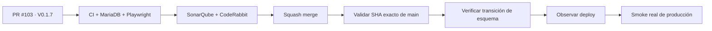

# Condor App — Snapshot de deploy V 0.1.7

> **Objetivo actual:** entregar el Slice 2 de administración con roles configurables, permisos acumulativos y alcance por sede, manteniendo aislamiento multi-tenant y compatibilidad con el acceso existente.

  <strong>Producto:</strong> Condor App ·
  <strong>Dominio:</strong> condorapp.com.co ·
  <strong>Runtime producción:</strong> PHP 8.5 ·
  <strong>Versión objetivo:</strong> V 0.1.7 ·
  <strong>Versión desplegada comprobada:</strong> V 0.1.4

## Estado del deploy

| Señal | Estado | Evidencia |
| --- | --- | --- |
| Base de código | ✅ **V 0.1.6 EN MAIN** | SHA `a019c6238ae6f8ef0c574834e3daddb9d81ffab4` |
| Producción comprobada | ✅ **V 0.1.4 VALIDADA EN PRODUCCIÓN** | último smoke real documentado |
| V 0.1.5 | ⏳ **MERGED, NO INFERIR PRODUCCIÓN** | observabilidad segura integrada |
| V 0.1.6 | ✅ **MERGED, NO INFERIR PRODUCCIÓN** | CI autoauditable/autocurable integrado por PR #90 |
| V 0.1.7 | 🚧 **EN VALIDACIÓN DE CÓDIGO** | Issue #102 / PR #103 |
| Roles por tenant | ✅ **IMPLEMENTADOS** | roles configurables y catálogo de permisos CRUD |
| Alcance por sede | ✅ **IMPLEMENTADO** | asignaciones Membership + Branch + Role |
| Administración visible | ✅ **IMPLEMENTADA** | UI para roles, permisos y asignaciones en el backoffice |
| Producción V 0.1.7 | ⏳ **NO VALIDADA** | requiere merge, exact-main, transición, deploy observado y smoke real |

## Qué se hizo

- Roles configurables por tenant con nombres únicos.
- Permisos CRUD por módulo como catálogo estable.
- Múltiples roles acumulativos por membresía.
- Alcance global del tenant o restringido por sede.
- Autorización efectiva calculada en backend.
- Compatibilidad temporal con `Membership::ROLE_OWNER`.
- Aislamiento tenant + sede reforzado con invariantes de dominio y claves foráneas compuestas.
- UI administrativa inicial para crear, editar y desactivar roles, gestionar permisos y asignar acceso por sede.
- Estado explícito cuando una membresía no tiene sedes accesibles, conservando el contexto de empresa.
- Rollback de migración protegido para no destruir roles/asignaciones existentes.

## Archivos de esta entrega

- `frontend/admin/AccessManagement.tsx`
- `frontend/admin/AdminApp.tsx`
- `frontend/admin/admin.css`
- `frontend/admin/api.ts`
- `frontend/admin/main.tsx`
- `migrations/Version20260921030000.php`
- `src/Application/Identity/BranchAuthorization.php`
- `src/Domain/Identity/Entity/BranchRoleAssignment.php`
- `src/Domain/Identity/Entity/Membership.php`
- `src/Domain/Identity/Entity/Role.php`
- `src/Domain/Identity/PermissionCatalog.php`
- `src/Domain/Organization/Entity/Branch.php`
- `src/Http/Controller/ApiContextController.php`
- `src/Http/Controller/BranchAccessController.php`
- `templates/admin/index.html.twig`
- pruebas PHP/E2E asociadas
- assets compilados de administración
- `config/version.php`, `package.json`, `package-lock.json`

## Validación

- CI Condor del head estable de PR #103: verde.
- Backend PHP/MariaDB, contratos/integración y Playwright Chromium: verdes.
- SonarQube Cloud: Quality Gate aprobado, 0 issues nuevos.
- CodeRabbit: findings válidos corregidos; sin threads accionables abiertos.
- Rama sincronizada sobre el `main` exacto V 0.1.6.
- Ningún resultado anterior implica despliegue ni validación real en producción.

## Flujo de entrega

## Qué sigue

| Horizonte | Bloque |
| --- | --- |
| **AHORA** | cerrar PR #103 y validar el SHA exacto de V 0.1.7 |
| **SIGUE** | consolidar auditoría CI-first de `AGENTES.md` en PR #105 |
| **DESPUÉS** | unificar progresivamente Admin y Super Admin mediante contexto de empresa y superficies compartidas |

## Fuentes de verdad

- [AGENTES.md](AGENTES.md) — protocolo operativo.
- [ESPECIFICACIONES.md](ESPECIFICACIONES.md) — decisiones durables.
- [Roadmap #1](https://github.com/pl0n3r/Condor/issues/1) — único Roadmap canónico.
- [Issue #102](https://github.com/pl0n3r/Condor/issues/102) / [PR #103](https://github.com/pl0n3r/Condor/pull/103) — entrega V 0.1.7.
