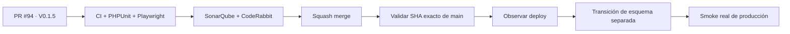

# Condor App — Snapshot de deploy V 0.1.5

> **Objetivo actual:** hacer que los errores 5xx de producción sean investigables de forma segura sin exponer logs crudos, secretos ni datos sensibles.

  <strong>Producto:</strong> Condor App ·
  <strong>Dominio:</strong> condorapp.com.co ·
  <strong>Runtime producción:</strong> PHP 8.5 ·
  <strong>Versión objetivo:</strong> V 0.1.5 ·
  <strong>Versión desplegada:</strong> V 0.1.4

## Estado del deploy

| Señal | Estado | Evidencia |
| --- | --- | --- |
| Producción vigente | ✅ **V 0.1.4 VALIDADA EN PRODUCCIÓN** | propietario único operativo y acceso real a `/adminpl0n3r` restaurado/validado |
| Base de esta entrega | ✅ **SIN DIVERGENCIA** | PR #94 parte del `main` exacto `f6fe2ef75e44681fde199fdf67e672312374e086` |
| V 0.1.5 | 🚧 **EN VALIDACIÓN DE CÓDIGO** | Issue #93 / PR #94 |
| Diagnóstico seguro | ✅ **IMPLEMENTADO** | error ID, request ID, fingerprint, versión/SHA y traza acotada |
| Enlaces compartibles | ✅ **IMPLEMENTADOS** | 256 bits, hash persistido, solo lectura, 30 min, revocables |
| Sanitización | ✅ **ENDURECIDA** | SQL/params DBAL redactados, secretos/PII básicos filtrados y UTF-8 seguro |
| Producción V 0.1.5 | ⏳ **NO DESPLEGADA** | requiere merge, deploy observado y transición de esquema separada |

## Qué se hizo

- Registro estructurado de incidentes 5xx con referencia segura para soporte.
- Panel exclusivo del propietario en `/adminpl0n3r/diagnosticos`.
- Enlaces temporales de diagnóstico sin headers, cookies, bodies, argumentos del stack, DSN ni secretos.
- Respuesta 5xx negociada: HTML para navegación y JSON genérico para clientes JSON.
- Redacción completa de SQL/parámetros en errores de base de datos.
- Truncado que preserva UTF-8 válido incluso ante bytes corruptos.
- Regresiones para impedir que tokens desconocidos, expirados o revocados revelen estados distintos.
- Comando `app:diagnostics:prune` con retención inicial de 14 días.

## Archivos de esta entrega

- `migrations/Version20260920221000.php`
- `src/Application/Observability/DiagnosticShareService.php`
- `src/Console/PruneDiagnosticsCommand.php`
- `src/Domain/Observability/Entity/DiagnosticShare.php`
- `src/Domain/Observability/Entity/ErrorIncident.php`
- `src/Http/Controller/PlatformDiagnosticsController.php`
- `src/Http/Controller/SharedDiagnosticController.php`
- `src/Infrastructure/Http/RequestIdSubscriber.php`
- `src/Infrastructure/Observability/ErrorIncidentRecorder.php`
- `src/Infrastructure/Observability/ErrorIncidentSubscriber.php`
- `src/Infrastructure/Observability/ErrorSanitizer.php`
- `templates/platform_owner/diagnostic_share.html.twig`
- `templates/platform_owner/diagnostics.html.twig`
- `templates/platform_owner/index.html.twig`
- `tests/php/Http/PlatformDiagnosticsControllerTest.php`
- `tests/php/Infrastructure/Observability/ErrorSanitizerTest.php`
- `config/packages/security.yaml`, `config/services.yaml`
- `config/version.php`, `package.json`, `package-lock.json`
- `AGENTES.md`, `ESPECIFICACIONES.md`, `README.md`

## Validación

- V 0.1.4: ✅ validada en producción.
- V 0.1.5: 🚧 CI, SonarQube y CodeRabbit deben quedar verdes sobre el head final después de estos hardenings.
- Migración `Version20260920221000`: **no se ejecuta automáticamente en producción**; deploy de código y transición de esquema se validan por separado.
- Ningún estado de CI se interpreta como `VALIDADO EN PRODUCCIÓN`.

## Flujo de entrega

## Qué sigue

| Horizonte | Bloque |
| --- | --- |
| **AHORA** | cerrar findings y gates finales de PR #94 / V 0.1.5 |
| **SIGUE** | PR #90 — CI autoauditable, autooptimizado y autocurable / V 0.1.6 |
| **DESPUÉS** | PR #103 — roles y permisos configurables por sede / V 0.1.7 |

## Fuentes de verdad

- [AGENTES.md](AGENTES.md) — protocolo operativo.
- [ESPECIFICACIONES.md](ESPECIFICACIONES.md) — decisiones durables.
- [Roadmap #1](https://github.com/pl0n3r/Condor/issues/1) — único Roadmap canónico.
- [Issue #93](https://github.com/pl0n3r/Condor/issues/93) / [PR #94](https://github.com/pl0n3r/Condor/pull/94) — entrega V 0.1.5.
