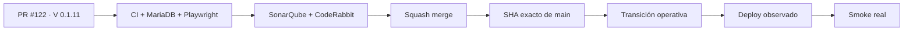

# Condor App — Snapshot operativo · candidato V 0.1.11

> **Objetivo actual:** habilitar operación delegada de Condor sin entregar privilegios globales: staff de plataforma, permisos por empresa/módulo/CRUD, creación de clientes e invitaciones seguras.

  <strong>Producto:</strong> Condor App ·
  <strong>Dominio:</strong> condorapp.com.co ·
  <strong>Runtime:</strong> PHP 8.5 ·
  <strong>Candidato:</strong> V 0.1.11 ·
  <strong>Producción comprobada:</strong> V 0.1.4

## Estado de entrega

| Señal | Estado | Evidencia |
| --- | --- | --- |
| Base integrada | ✅ **V 0.1.10 EN MAIN** | SHA `3d08b63306e094f73710f7fe17454da5d91351e1` |
| Candidato actual | 🚧 **V 0.1.11 EN VALIDACIÓN** | Issue #116 / PR #122 |
| Producción comprobada | ✅ **V 0.1.4 VALIDADA EN PRODUCCIÓN** | último smoke real documentado |
| Staff de plataforma | ✅ **IMPLEMENTADO EN CANDIDATO** | permisos explícitos por tenant + módulo + CRUD |
| Invitaciones | ✅ **IMPLEMENTADAS EN CANDIDATO** | token hasheado, expiración, revocación, reemisión y consumo único |
| Creación de clientes | ✅ **IMPLEMENTADA EN CANDIDATO** | reutiliza el onboarding canónico |
| Notificaciones | ✅ **BASE IMPLEMENTADA** | `in_app` + `email`, preferencias y eventos obligatorios |
| Producción V 0.1.11 | ⏳ **NO VALIDADA** | requiere merge, exact-main, transición, deploy observado y smoke real |

## Qué incorpora V 0.1.11

- `ROLE_PLATFORM_STAFF` separado del propietario global y de las membresías de clientes.
- Alcance explícito por empresa, módulo y acciones CRUD, validado server-side.
- Matriz visual de permisos y estado de invitaciones en `/adminpl0n3r`.
- Creación de empresas desde Super Admin reutilizando el servicio de onboarding.
- Invitaciones de un solo uso: el token bruto no se persiste y la persona define su contraseña.
- Reenvío/revocación con rate limiting y auditoría.
- Contrato de correo transaccional desacoplado del proveedor.
- Notificaciones `in_app` y `email` con preferencias por usuario/evento/canal.
- Eventos de seguridad obligatorios que no pueden silenciarse con preferencias ordinarias.
- Pruebas negativas de autorización, alcance entre tenants y escalamiento.

## Flujo de entrega

## Qué sigue

| Horizonte | Bloque |
| --- | --- |
| **AHORA** | estabilizar y fusionar #116 / PR #122 como V 0.1.11 |
| **EN PARALELO** | storefront administrable #130 / PR #136 y contratos REST #127 / PR #137 |
| **SIGUE** | ordenar el candidato V 0.1.12 sobre el nuevo `main` |
| **DESPUÉS** | Catálogo Producto + Variante — Slice 3 / Issue #131 |

## Fuentes de verdad

- [AGENTES.md](AGENTES.md) — protocolo operativo.
- [ESPECIFICACIONES.md](ESPECIFICACIONES.md) — decisiones durables.
- [Roadmap #1](https://github.com/pl0n3r/Condor/issues/1) — único Roadmap canónico.
- [Issue #116](https://github.com/pl0n3r/Condor/issues/116) / [PR #122](https://github.com/pl0n3r/Condor/pull/122) — candidato V 0.1.11.
- [Issue #130](https://github.com/pl0n3r/Condor/issues/130) / [PR #136](https://github.com/pl0n3r/Condor/pull/136) — storefront administrable.
- [Issue #127](https://github.com/pl0n3r/Condor/issues/127) / [PR #137](https://github.com/pl0n3r/Condor/pull/137) — contratos REST.

> **Regla de estado:** CI verde o un merge prueban código, no producción. Solo evidencia del despliegue y smoke real permite declarar **VALIDADO EN PRODUCCIÓN**.
