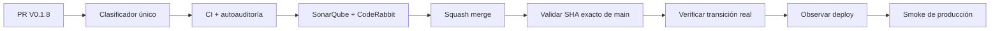

# Condor App — Snapshot de deploy V 0.1.8

> **Objetivo actual:** impedir que una transición operativa necesaria quede oculta durante un release y evitar validar producción con estado incompleto.

  <strong>Producto:</strong> Condor App ·
  <strong>Dominio:</strong> condorapp.com.co ·
  <strong>Runtime producción:</strong> PHP 8.5 ·
  <strong>Versión objetivo:</strong> V 0.1.8 ·
  <strong>Versión desplegada comprobada:</strong> V 0.1.4

## Estado del deploy

| Señal | Estado | Evidencia |
| --- | --- | --- |
| Base de código | ✅ **V 0.1.7 EN MAIN** | SHA `78f65d94053f22c63b70e530d592293ee8dbeb7d` |
| Producción comprobada | ✅ **V 0.1.4 VALIDADA EN PRODUCCIÓN** | último smoke real documentado |
| V 0.1.5–0.1.7 | ✅ **MERGED / NO INFERIR PRODUCCIÓN** | observabilidad, CI y permisos por sede integrados |
| V 0.1.8 | 🚧 **EN VALIDACIÓN DE CÓDIGO** | Issue #107 / PR de entrega |
| Detector de transición | ✅ **AMPLIADO** | esquema, configuración, comandos, rutas/controladores, identidad/roles, entidades, servicios y scripts operativos |
| Observador de release | ✅ **UNIFICADO** | reutiliza el clasificador canónico; sin regex paralela |
| Autoauditoría | ✅ **ENDURECIDA** | rechaza un clasificador invocado cuyo resultado no controle `requerida` |
| Producción V 0.1.8 | ⏳ **NO VALIDADA** | requiere merge, exact-main, transición, deploy observado y smoke real |

## Qué se hizo

- Centralización de la señal `transicion_release` en el clasificador canónico.
- Cobertura explícita de cambios de esquema, configuración, comandos, rutas/controladores, roles, entidades persistentes, servicios y scripts de provisioning/backfill/deploy/release.
- `observar-release` deja de mantener lógica de detección paralela.
- Autoauditoría para comprobar que el resultado `transicion_release` se usa realmente en la decisión del workflow.
- Regresiones positivas y negativas para evitar falsos verdes.
- La detección automática sigue siendo una señal de seguridad: no ejecuta migraciones ni mutaciones de producción.

## Archivos de esta entrega

- `.github/workflows/observar-release.yml`
- `scripts/ci_change_classifier.py`
- `scripts/ci_self_audit.py`
- `tests/test_ci_change_classifier.py`
- `tests/test_ci_self_audit.py`
- `config/version.php`
- `package.json`
- `package-lock.json`
- `README.md`

## Validación

- CI Condor debe quedar verde sobre el head estable de la PR.
- SonarQube Cloud y CodeRabbit deben validar ese mismo head.
- Después del merge se valida por separado el SHA exacto de `main`.
- Ningún gate de código equivale a `VALIDADO EN PRODUCCIÓN`.

## Flujo de entrega

## Qué sigue

| Horizonte | Bloque |
| --- | --- |
| **AHORA** | cerrar gates y merge de V 0.1.8 |
| **SIGUE** | formalizar y comenzar la administración unificada Admin/Super Admin con contexto de empresa |
| **DESPUÉS** | mostrar progresivamente en el Super Admin los siguientes slices de backend mediante superficies compartidas |

## Fuentes de verdad

- [AGENTES.md](AGENTES.md) — protocolo operativo.
- [ESPECIFICACIONES.md](ESPECIFICACIONES.md) — decisiones durables.
- [Roadmap #1](https://github.com/pl0n3r/Condor/issues/1) — único Roadmap canónico.
- [Issue #107](https://github.com/pl0n3r/Condor/issues/107) — detección automática de transición.
