# Condor App — Snapshot operativo · objetivo V 0.1.9

> **Objetivo actual:** convertir el Super Admin en un centro de control real, compartiendo la misma base visual del Admin y permitiendo entrar al contexto de una empresa sin suplantar usuarios.

  <strong>Producto:</strong> Condor App ·
  <strong>Dominio:</strong> condorapp.com.co ·
  <strong>Runtime producción:</strong> PHP 8.5 ·
  <strong>Versión objetivo:</strong> V 0.1.9 ·
  <strong>Versión desplegada comprobada:</strong> V 0.1.4

## Estado del deploy

| Señal | Estado | Evidencia |
| --- | --- | --- |
| Base de código | ✅ **V 0.1.8 EN MAIN** | SHA `79bd9db59a61cc8e211321c0fd52392ecbf1ddc2` |
| Producción comprobada | ✅ **V 0.1.4 VALIDADA EN PRODUCCIÓN** | último smoke real documentado |
| V 0.1.5–0.1.8 | ✅ **MERGED / NO INFERIR PRODUCCIÓN** | observabilidad, CI, permisos y transición de release integrados |
| Dominios personalizados | ✅ **DECISIÓN DOCUMENTADA** | D-049 / Issue #114, sin consumir una release productiva |
| V 0.1.9 | 🚧 **EN VALIDACIÓN DE CÓDIGO** | Issue #113 / PR #118 |
| Super Admin compartido | ✅ **IMPLEMENTADO** | shell común, métricas reales y contexto read-only por tenant |
| Producción V 0.1.9 | ⏳ **NO VALIDADA** | requiere merge, exact-main, transición, deploy observado y smoke real |

## Qué se hizo

- `/admin` y `/adminpl0n3r` reutilizan el mismo shell administrativo y componentes de resumen.
- El centro de control global carga métricas reales de empresas, usuarios, sedes y membresías.
- El propietario puede seleccionar una empresa sin cambiar su identidad autenticada.
- Una barra persistente deja claro cuándo se está operando dentro del contexto de un tenant.
- El primer contexto de empresa es deliberadamente read-only hasta que cada módulo compartido tenga autorización server-side segura.
- Se añadieron pruebas HTTP para acceso propietario, rechazo de usuarios normales, selección de tenant, actor real y tenant inexistente.
- Los assets compilados del Admin/Super Admin quedan versionados junto con el código fuente.

## Archivos principales de esta entrega

- `frontend/admin/AdminShell.tsx`
- `frontend/admin/OverviewGrid.tsx`
- `frontend/admin/PlatformOwnerApp.tsx`
- `frontend/admin/AdminApp.tsx`
- `frontend/admin/api.ts`
- `frontend/admin/main.tsx`
- `frontend/admin/admin.css`
- `src/Application/Identity/PlatformOwnerTenantContext.php`
- `src/Http/Controller/PlatformOwnerContextController.php`
- `src/Http/Controller/PlatformOwnerController.php`
- `templates/platform_owner/index.html.twig`
- `tests/php/Http/PlatformOwnerControllerTest.php`
- assets compilados de administración
- metadata de versión V 0.1.9

## Validación

- Backend PHP/MariaDB, contratos/integración y Playwright deben quedar verdes sobre el head final.
- SonarQube Cloud debe mantener Quality Gate aprobado y 0 hallazgos nuevos.
- CodeRabbit debe revisar el mismo head sin findings accionables pendientes.
- Después del merge se valida por separado el SHA exacto de `main`.
- Ningún gate de código equivale a `VALIDADO EN PRODUCCIÓN`.

## Flujo de entrega

```mermaid
flowchart LR
    A[PR #118 · V0.1.9] --> B[Centro de control global]
    B --> C[CI + Playwright + MariaDB]
    C --> D[SonarQube + CodeRabbit]
    D --> E[Squash merge]
    E --> F[Validar SHA exacto de main]
    F --> G[Verificar transición]
    G --> H[Observar deploy]
    H --> I[Smoke real]
```

## Qué sigue

| Horizonte | Bloque |
| --- | --- |
| **AHORA** | cerrar #113 / PR #118 y validar V 0.1.9 en código |
| **SIGUE** | staff de plataforma, invitaciones y notificaciones — Issue #116 |
| **EN PARALELO** | storefront mínimo y conexión del primer dominio real sobre D-049 |
| **DESPUÉS** | habilitar módulos compartidos del Admin dentro del contexto propietario de forma progresiva |

## Fuentes de verdad

- [AGENTES.md](AGENTES.md) — protocolo operativo.
- [ESPECIFICACIONES.md](ESPECIFICACIONES.md) — decisiones durables.
- [Roadmap #1](https://github.com/pl0n3r/Condor/issues/1) — único Roadmap canónico.
- [Issue #113](https://github.com/pl0n3r/Condor/issues/113) / [PR #118](https://github.com/pl0n3r/Condor/pull/118) — centro de control V 0.1.9.
- [Issue #116](https://github.com/pl0n3r/Condor/issues/116) — staff, invitaciones y notificaciones.
- [Issue #114](https://github.com/pl0n3r/Condor/issues/114) — dominios personalizados/storefront.
