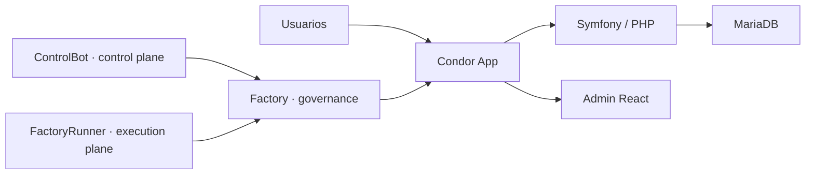

# Condor App

> Plataforma SaaS modular, multi-tenant y mobile-first para comercio, operación y administración.

**Rol en la fábrica:** producto independiente · **Fase:** construcción · **Roadmap:** [Issue #1](https://github.com/pl0n3r/Condor/issues/1)

**Candidato de reparación:** V0.1.88 · Issue #355 · clasificación read-only de Entitlements. Esta identidad candidata no implica validación productiva.

Condor mantiene su código, datos, deploy y operación separados. Factory aporta gobernanza y contratos compartidos; ControlBot es el control plane y FactoryRunner el execution plane.

## Operational Cockpit

<!-- factory:status:start -->
| Señal | Estado |
| --- | --- |
| main SHA | UNKNOWN |
| versión | UNKNOWN |
| CI | UNKNOWN |
| release | UNKNOWN |
| health | UNKNOWN |
| smoke/observer | UNKNOWN |
| quality/security | UNKNOWN |
| Issue activo | UNKNOWN |
| PR activo | UNKNOWN |
| último release | UNKNOWN |
<!-- factory:status:end -->

### Progress + Readiness

<!-- factory:progress-readiness:start -->
| Señal | Estado |
| --- | --- |
| Target | UNKNOWN |
| Progress | UNKNOWN |
| Readiness | UNKNOWN |
| Evidence freshness | UNKNOWN |
| Critical blockers | UNKNOWN |
| Trend | UNKNOWN |

| Dimensión | Progress | Readiness |
| --- | --- | --- |
| UNKNOWN | UNKNOWN | UNKNOWN |
<!-- factory:progress-readiness:end -->

> Los bloques operativos son derivados. UNKNOWN/PENDING falla cerrado; GREEN o DEGRADED requieren evidencia canónica.

## Work Queue

- **NOW:** [trabajo reservado](https://github.com/pl0n3r/Condor/issues?q=is%3Aissue+is%3Aopen+label%3A%22estado%3A+reservado%22).
- **NEXT:** [Issues críticos disponibles](https://github.com/pl0n3r/Condor/issues?q=is%3Aissue+is%3Aopen+label%3A%22prioridad%3A+cr%C3%ADtica%22+label%3A%22estado%3A+disponible%22).
- **LATER:** [Roadmap canónico #1](https://github.com/pl0n3r/Condor/issues/1).
- **BLOCKED:** [bloqueos vigentes](https://github.com/pl0n3r/Condor/issues?q=is%3Aissue+is%3Aopen+label%3A%22estado%3A+bloqueado%22).

Esta vista resume la cola y enlaza la planificación canónica; no reemplaza Roadmap, Issues, decisiones ni releases.

## Qué hace el producto

Condor reúne capacidades de catálogo, operaciones, administración y comercio sobre un modelo multi-tenant. Cada vertical slice preserva aislamiento de tenant, autoridad server-side y contratos explícitos.

## Arquitectura en 60 segundos


```mermaid
flowchart LR
    U["Usuarios"] --> C["Condor App"]
    C --> B["Symfony / PHP"]
    C --> A["Admin React"]
    B --> D["MariaDB"]
    F["Factory · governance"] --> C
    O["ControlBot · control plane"] --> F
    R["FactoryRunner · execution plane"] --> F
```

El backend es autoridad final. RBAC, tenancy, persistencia y validación permanecen server-side; README no es fuente de configuración operativa.

## Stack e infraestructura

PHP 8.5, Symfony 7.4 LTS, MariaDB/MySQL-compatible, Doctrine, React + TypeScript + Vite, Twig/SSR y GitHub Actions. El target productivo es Hostinger shared hosting, sin procesos Node permanentes como requisito de runtime.

## Ciclo de entrega

Issue → reserva Factory → rama canónica → implementación → PR → CI/aceptación/revisores → merge → release/deploy → health/smoke/observer.

La identidad humana de release vive exclusivamente en `config/version.php`. El README no se reescribe por promociones de dependencias ni sustituye versión, release, health o roadmap.

## Calidad y seguridad

- Factory v1 gobierna CI común, coordinación, aceptación, roles, etiquetas, releases y política.
- Condor conserva gates locales de PHP, TypeScript, dependencias, backup/restore, Playwright y observer.
- Multi-tenancy, secretos fuera del repo, migraciones expand-compatible y fail-closed son invariantes.
- Un merge o CI verde no equivale por sí solo a producción validada.

## Roadmap y fuentes de verdad

- **Roadmap:** [Issue #1](https://github.com/pl0n3r/Condor/issues/1)
- **Contrato local:** [AGENTES.md](AGENTES.md)
- **Decisiones normativas:** [decisiones.yml](decisiones.yml)
- **Especificaciones:** [ESPECIFICACIONES.md](ESPECIFICACIONES.md)
- **Datos y privacidad:** [datos.yml](datos.yml)
- **Trabajo ejecutable:** [GitHub Issues](https://github.com/pl0n3r/Condor/issues)
- **Cambios revisados:** [Pull Requests](https://github.com/pl0n3r/Condor/pulls)
- **Gobernanza común:** [Factory@v1](https://github.com/pl0n3r/factory/tree/v1)

## Desarrollo local

Instala dependencias PHP/Node según los archivos lock. Para esta adopción contractual:

```bash
python3 tests/test_readme_contract_adoption.py
python3 tests/test_release_identity_guard.py
```

Antes de entregar cambios PHP/tooling, Condor exige también PHPStan y Rector según AGENTES.md.

## Mapa de la fábrica

- **Factory:** governance/kit y contratos compartidos.
- **ControlBot:** control plane privado.
- **FactoryRunner:** execution plane autónomo.
- **AutoFactory:** herramienta local/manual separada.
- **Condor / GrindFlow / BRVTAL:** productos independientes.

La cola automática no altera estas responsabilidades.
